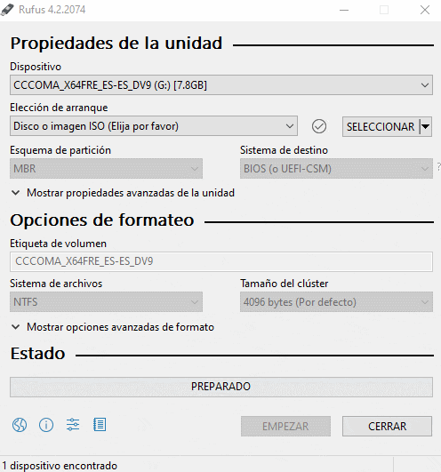

## Índice
1. [Descargar Ventoy](https://www.ventoy.net/en/download.html)
2. [Descargar Rufus](https://rufus.ie/)
3. [Descargar Windows y Office desde la fuente completa](https://tb.rg-adguard.net/public.php)
4. [Descargar Windows 10 Enterprise](https://www.microsoft.com/en-us/evalcenter/evaluate-windows-10-enterprise)
5. [Descargar Windows 11 Enterprise](https://www.microsoft.com/en-us/evalcenter/evaluate-windows-11-enterprise)
6. [Descargar Windows 10 Enterprise LTSC](https://www.microsoft.com/es-es/evalcenter/download-windows-10-enterprise)
7. [Descargar Windows 11 Enterprise LTSC](https://www.microsoft.com/es-es/evalcenter/download-windows-11-enterprise)
8. [Descargar Windows 8.1](https://www.microsoft.com/es-es/software-download/windows8ISO)
9. [Restablecer Windows a la Configuración de Fábrica](#9-restablecer-windows-a-la-configuración-de-fábrica)
10. [Creación de una Cuenta Local en Windows durante la Instalación](#10-creación-de-una-cuenta-local-en-windows-durante-la-instalación)
11. [Windows 11 Home sin conexión a internet](#11-windows-11-home-sin-conexión-a-internet)
12. [Instalación de Windows sin Bloatware](#12-instalación-de-windows-sin-bloatware)
13. [Seleccionar el Idioma una Vez Instalado Windows](#13-seleccionar-el-idioma-una-vez-instalado-windows)
14. [Instalación de Windows sin USB](#14-instalación-de-windows-sin-usb)
15. [Versiones de Windows](#Versiones-de-Windows)
16. [Licencia](#licencia)
17. [Dando Estrella](#dando-estrella)

---

# 1. **Descargar Ventoy:**
   - **Descripción:** Obtén Ventoy, una herramienta que te permite crear unidades USB de arranque múltiple de manera sencilla.
   - **Enlace:** [Descargar Ventoy](https://www.ventoy.net/en/download.html)

# 2. **Rufus:**
   - **Descripción:** Descarga Rufus, una aplicación para crear unidades USB de arranque, útil para instalar sistemas operativos y herramientas de recuperación.
   - **Enlace:** [Descargar Rufus](https://rufus.ie/)

   

# 3. **Windows y Office:**
   - **Descripción:** Accede a una fuente completa de descargas que incluye todas las versiones de Windows y Office.
   - **Enlace:** [Descargar Windows y Office desde la fuente completa](https://tb.rg-adguard.net/public.php)

# 4.  **Windows 10 Enterprise:**
   - **Descripción:** Obtén Windows 10 Enterprise, una edición de Windows diseñada para empresas con características avanzadas.
   - **Enlace:** [Descargar Windows 10 Enterprise](https://www.microsoft.com/en-us/evalcenter/evaluate-windows-10-enterprise)

# 5.  **Windows 11 Enterprise:**
   - **Descripción:** Descarga Windows 11 Enterprise, la edición empresarial de Windows 11 con características avanzadas de seguridad y administración.
   - **Enlace:** [Descargar Windows 11 Enterprise](https://www.microsoft.com/en-us/evalcenter/evaluate-windows-11-enterprise)

# 6.  **Windows 10 Enterprise LTSC:**
   - **Descripción:** Descarga Windows 10 Enterprise LTSC, la edición empresarial de Windows 10 con características avanzadas de seguridad y administración.
   - **Enlace:** [Descargar Windows 10 Enterprise](https://www.microsoft.com/es-es/evalcenter/download-windows-10-enterprise)

# 7.  **Windows 11 Enterprise LTSC:**
   - **Descripción:** Descarga Windows 11 Enterprise LTSC, la edición empresarial de Windows 11 con características avanzadas de seguridad y administración.
   - **Enlace:** [Descargar Windows 11 Enterprise](https://www.microsoft.com/es-es/evalcenter/download-windows-11-enterprise)

# 8.  **Windows 8.1:**
   - **Descripción:** Descarga Windows 8.1 , la edición de Windows 8.1 con menos consumo.
   - **Enlace:** [Descargar Windows 8.1](https://www.microsoft.com/es-es/software-download/windows8ISO)

# 9. **Restablecer Windows a la Configuración de Fábrica**
   - Si deseas restablecer **Windows** a su configuración **de fábrica**, simplemente ejecuta el siguiente comando en una ventana de comandos con privilegios de administrador:
````systemreset --factoryreset````

---

# 10. Creación de una Cuenta Local en Windows durante la Instalación

Si deseas crear una cuenta local en Windows durante el proceso de instalación, puedes seguir este truco:

1. En el campo de dirección de correo electrónico, ingresa una dirección ficticia, por ejemplo, `a@a.com`.
2. Asigna cualquier contraseña.
3. Continúa con el proceso de instalación.

Es probable que durante el proceso aparezca un error relacionado con la dirección de correo electrónico. Sin embargo, al aceptar ese error, se te permitirá continuar creando una cuenta local en lugar de vincular una cuenta de Microsoft.

Este método proporciona una opción conveniente para aquellos que prefieren mantener su sistema sin una cuenta en línea.

---

# 11. **Windows 11 Home sin conexión a internet:**

Durante la instalación de Windows 11, si deseas realizar la configuración sin conexión a internet, sigue estos pasos:

1. Desconecta el internet antes de comenzar la instalación.
2. Cuando llegues a la pantalla donde se requiere la conexión a internet, realiza uno de los siguientes pasos:

   A. Presiona `Shift + F10` para abrir la ventana de comandos.
      - Escribe `taskmgr` y cierra el proceso 'flujo de conexión de red'.
      - Cierra la ventana de comandos (`cmd`).
      - Retrocede en el asistente y continúa con la instalación.

   o

   B. Escribe `oobe\bypassnro` y presiona Enter. Esto habilitará la opción 'No tengo internet' y te permitirá crear una cuenta local.
   
Estos pasos te permitirán configurar Windows 11 Home sin conexión a internet y elegir la opción que mejor se adapte a tus necesidades.

---

# 12. **Instalación de Windows sin Bloatware:**

En el asistente de instalación de Windows, cuando llegues a la configuración de la hora y la moneda, seleccionar "Inglés Internacional" puede ayudarte a obtener una instalación más limpia de Windows, con menos bloatware o software innecesario preinstalado. Aquí te explicamos cómo hacerlo:

1. Durante la instalación de Windows, llegarás a una pantalla donde se te pedirá configurar la hora, la moneda y otros detalles regionales.

2. En la lista desplegable de idioma o región, selecciona "Inglés Internacional" en lugar de la opción regional específica, como "Inglés (Estados Unidos)".

3. Continúa con el proceso de instalación siguiendo las instrucciones estándar.

Seleccionar "Inglés Internacional" en lugar de una variante regional específica puede ayudar a evitar que se instalen aplicaciones o ajustes adicionales que a veces se incluyen en versiones específicas de Windows. Esto puede resultar en una instalación más limpia y personalizable que te permite agregar solo las aplicaciones y configuraciones que realmente necesitas.

Recuerda que esta opción de idioma es solo uno de los factores que influyen en la instalación de Windows, y la cantidad de software preinstalado puede variar según la edición y la fuente de instalación. Siempre es recomendable realizar un seguimiento de las opciones de instalación y ajustes para personalizar tu sistema según tus necesidades.

---

# 13. **Seleccionar el Idioma una Vez Instalado Windows:**

Una vez que Windows está instalado, puedes cambiar el idioma de la interfaz del sistema en cualquier momento siguiendo estos pasos:

1. Haz clic en el botón "Inicio" y selecciona "Configuración" (el ícono de engranaje).

2. En la ventana de Configuración, selecciona "Hora e Idioma".

3. En el menú de la izquierda, haz clic en "Idioma" y, en la sección "Idiomas preferidos", haz clic en "Agregar un idioma".

4. Busca y selecciona el idioma que deseas agregar y haz clic en "Siguiente".

5. Windows descargará el paquete de idioma seleccionado. Una vez que esté instalado, podrás cambiar el idioma predeterminado desde la lista de idiomas preferidos.

6. Para cambiar el idioma de la interfaz, simplemente arrastra el idioma deseado a la parte superior de la lista.

7. Windows te pedirá que establezcas este idioma como predeterminado. Haz clic en "Establecer como predeterminado".

8. Reinicia tu computadora para aplicar los cambios.

Ahora, la interfaz de Windows se mostrará en el nuevo idioma que hayas seleccionado.

---

# 14. Instalación de Windows sin USB

Si necesitas instalar Windows sin utilizar un USB, puedes seguir estos pasos:

1. **Descargar ISO de Windows:**
   - Asegúrate de tener una imagen ISO del sistema operativo de Windows que desees instalar.

2. **Crear Partición:**
   - Utiliza la herramienta `diskpart` para crear una partición con el tamaño del ISO.
     ```bash
     diskpart
     list disk
     select disk [Número del Disco]
     create partition primary size=[Tamaño del ISO en GB * 1024]
     exit
     ```

3. **Montar la Imagen ISO:**
   - Puedes montar la imagen ISO directamente en Windows o utilizar software de terceros para emular una unidad de disco virtual.

4. **EasyBCD (Neosmart):**
   - Descarga e instala [EasyBCD](https://neosmart.net/EasyBCD/), una herramienta que te permitirá gestionar el arranque del sistema.
   - Abre EasyBCD y selecciona la opción "Add New Entry".
   - En la sección "Portable/External Media", elige "ISO" y selecciona la ubicación de tu archivo ISO.
   - Guarda los cambios.

5. **Reinicia el Sistema:**
   - Reinicia tu computadora y accede al menú de arranque. Puedes hacer esto presionando la tecla correspondiente durante el inicio (generalmente F2, F10, F12 o Esc, según el fabricante de tu PC).
   - Selecciona la opción para arrancar desde la partición en la que montaste el ISO.

6. **Instalación de Windows:**
   - Sigue los pasos normales de instalación de Windows desde la imagen montada.

**Nota:** Estos pasos pueden variar según la configuración de tu sistema y la versión de Windows que estás instalando. Asegúrate de respaldar tus datos antes de realizar cambios significativos en la configuración del disco.

---

# Versiones de Windows

## Windows Home

**Descripción:** Diseñada para usuarios domésticos y pequeñas empresas. Incluye funciones esenciales como el menú Inicio renovado, el asistente virtual Cortana, el navegador Microsoft Edge y la tienda Windows Store.

- **Recomendación:** Ideal para usuarios domésticos que buscan una experiencia de usuario intuitiva y funcionalidades esenciales.
- **Características Destacadas:**
  - Menú Inicio renovado.
  - Asistente virtual Cortana.
  - Navegador Microsoft Edge.
  - Tienda Windows Store para aplicaciones.

---

## Windows Pro

**Descripción:** Similar a la edición Home, pero con características adicionales orientadas a usuarios empresariales y profesionales. Incluye funciones como BitLocker (para cifrado de disco), Hyper-V (virtualización) y políticas de grupo avanzadas.

- **Recomendación:** Recomendado para usuarios avanzados, entusiastas y pequeñas empresas. Ofrece características empresariales adicionales.
- **Características Destacadas:**
  - BitLocker para cifrado de disco.
  - Hyper-V para virtualización.
  - Políticas de grupo avanzadas.

---

## Windows Enterprise

**Descripción:** Diseñada para grandes empresas y organizaciones. Incluye todas las características de Windows Pro, así como funciones adicionales centradas en la seguridad y la gestión de dispositivos a nivel empresarial.

---

## Windows Education

**Descripción:** Similar a Windows Enterprise, pero diseñada específicamente para entornos educativos. Incluye herramientas para la gestión de aulas y funciones específicas para el ámbito educativo.

---

## Windows S

**Descripción:** Una versión simplificada de Windows diseñada para ser más segura y eficiente en términos de rendimiento. Solo permite la instalación de aplicaciones desde la Microsoft Store, lo que reduce el riesgo de malware.

- **Recomendación:** Enfocado en seguridad y eficiencia. Adecuado para usuarios que desean un entorno más controlado y seguro.
- **Características Destacadas:**
  - Instalación de aplicaciones solo desde la Microsoft Store.
  - Reducción del riesgo de malware.

---

## Windows Pro for Workstations

**Descripción:** Orientada a estaciones de trabajo de alto rendimiento y usuarios avanzados que requieren capacidades de hardware y rendimiento extremas, como procesadores de varios núcleos y grandes cantidades de memoria RAM.

- **Recomendación:** Diseñado para estaciones de trabajo de alto rendimiento. Ideal para usuarios avanzados que requieren capacidades extremas de hardware y rendimiento.
- **Características Destacadas:**
  - Soporte para hardware de estaciones de trabajo.
  - Rendimiento optimizado para cargas de trabajo intensivas.

---

## Windows IoT (Internet of Things)

**Descripción:** Diseñada para dispositivos y sistemas integrados en el Internet de las cosas (IoT). Hay varias ediciones, como Windows IoT Core, Windows IoT Enterprise, cada una adaptada para diferentes tipos de dispositivos y aplicaciones específicas.

---

## Windows Server

**Descripción:** Diseñado para entornos de servidor. Hay varias ediciones, como Windows Server Standard y Windows Server Datacenter, cada una con diferentes características y capacidades para satisfacer las necesidades específicas de servidores empresariales.

---

## Windows Home N

**Descripción:** Similar a Windows Home, pero sin el Reproductor de Windows Media preinstalado.

---

## Windows Pro N

**Descripción:** Similar a Windows Pro, pero sin el Reproductor de Windows Media preinstalado.

---

## Windows Enterprise N

**Descripción:** Similar a Windows Enterprise, pero sin el Reproductor de Windows Media preinstalado.

Estas ediciones "N" se proporcionan para cumplir con las regulaciones antimonopolio y permitir que los usuarios elijan e instalen su propio software multimedia si lo desean. Ten en cuenta que esta información puede haber cambiado desde mi última actualización, así que siempre es recomendable verificar las últimas fuentes de Microsoft para obtener la información más reciente.

---

## Licencia
Este proyecto está bajo la licencia [Creative Commons Attribution 4.0 International License](https://creativecommons.org/licenses/by/4.0/). Puedes compartir, adaptar y utilizar estos archivos siempre que des el crédito correspondiente al autor original.

## Dando Estrella
Si encuentras útiles estos scripts o te han ayudado de alguna manera, ¡por favor considera darle una estrella a este repositorio! Tu apoyo es muy apreciado y nos ayuda a seguir compartiendo recursos útiles con la comunidad.
